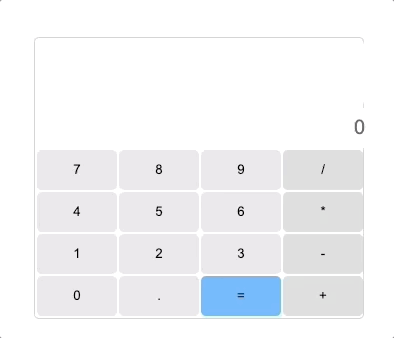

# Calculatrice en symfony

Ce projet est une calculatrice qui implémente les opérations élémentaires suivant (+ - * /)



### Arborescence Fichier

    .
    ├── docker                         # All docker images folder
    │   ├── nginx                      # Image docker nginx & vhost config
    │   ├── php-fpm                    # Image docker & requirement php-fpm for symfony
    │   ├── databbase                  # Image docker mariadbb
    │   ├── docker-compose             # Docker -compose file to run the project env
    │   └── .env                       # docker env variables
    ├── src
    │   └── Controller                 # List of available controllers
    │       └── CalculatorController   # Calculator controller
    ├── templates                      # twig templates files
    │   ├── base.html.twig             # common elements of all application
    │   └── calculator             
    │       └── index.html.twig        # twig for calculator application         
    ├── public                         # Documentation files (alternatively `doc`)
    │   ├── css                        # Calculator styles
    │   └── js                         # Calculator javascripts
    ├── tests 
    │   └── Feat 
    │       └── CalculatorControllerTest   # CalculatorController phpUnit tests
    └── ...


### Installing

Le projet tourne sur des conteneurs docker:

- Conteneur php-fpm
- Conteneur nginx 

il y a une conteneur mariadb pour la base de données mais elle n'est pas utilisé pour ce projet (elle est commenté au niveau le docker compose ).


Première manière pour lancer l'application, il faut installer docker d'abord
Aller à la racine de projet et faire:
```

cd docker
docker-compose up -d
```

Pour accèder à l'application il faut y aller sur le lien http://localhost/calculate


Pour arrêter les conteneurs docker

```
docker-compose stop

```

Deuxième manière pour lancer l'application, on peut aussi utiliser le serveur interne symfony, il faut intaller composer d'abord. Aller à la racine de projet et faire:

```

composer install
symfony server:start
```

Dans ce cas pour accèder à l'application il faut y aller sur le lien http://localhost:8000/calculate


```

## Exécution des tests


Pour exécuter les tests exécutés

```
php bin/phpunit
```
